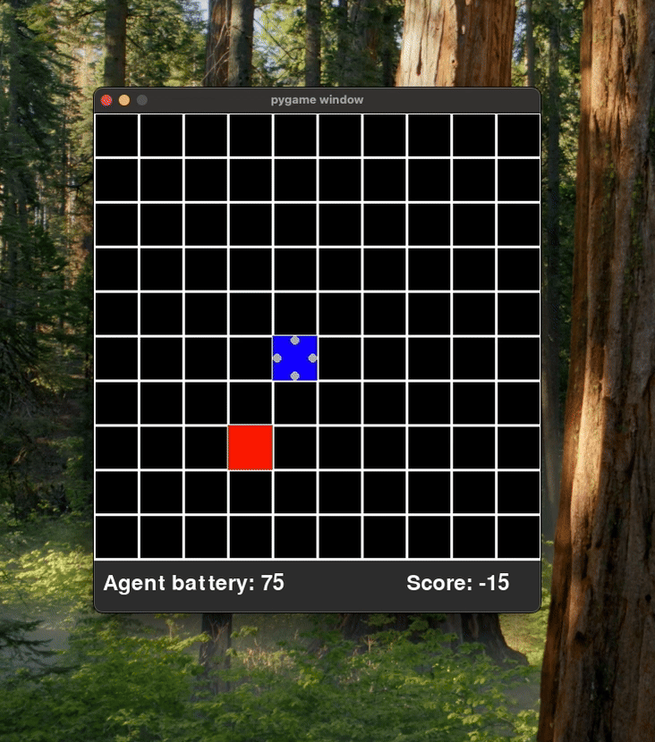

# Human Feedback-Based Reinforcement Learning in Cooperative Environments

## Project Overview

This project explores how AI agents can learn to guide humans toward goals through reinforcement learning. The core idea is simple: an AI agent knows where a goal is located, but the human doesn't. The agent must learn how to effectively guide the human to reach this goal.

In the current implementation:
- The environment is a grid-based game where the human player (red square) must find a goal
- The AI agent (blue square) can move around and toggle directional lights to guide the human
- The agent receives rewards when the human moves closer to the goal and penalties when the human moves away
- The agent learns over time to provide better guidance through reinforcement learning

## Demo

 

## Features

- Grid-based environment with human and AI agent interaction
- Multiple reinforcement learning algorithms (PPO, TRPO, A2C)
- Training and evaluation modes
- Performance tracking and visualization
- Customizable environment settings

## Getting Started

### Prerequisites

- Python 3.8 or higher
- pip (Python package installer)

### Installation

1. Clone this repository:
   ```
   git clone https://github.com/watch-raider/RL-Game.git
   cd human-feedback-rl
   ```

2. Create a virtual environment (recommended):
   ```
   python -m venv venv
   ```

3. Activate the virtual environment:
   - On Windows:
     ```
     venv\Scripts\activate
     ```
   - On macOS/Linux:
     ```
     source venv/bin/activate
     ```

4. Install the required packages:
   ```
   pip install -r requirements.txt
   ```

### Running the Application

1. Navigate to the environment directory:
   ```
   cd env
   ```

2. Run the main application:
   ```
   python main.py
   ```

3. Use the menu to:
   - Select screen size
   - Choose a learning model (PPO, TRPO, or A2C)
   - Select mode (Training or Evaluation)
   - Start the game

### How to Play

- **As a human player**: Use the arrow keys to move the red square
- **Watch the AI agent**: The blue square will move and toggle lights to guide you
- **Goal**: Follow the agent's guidance to find the hidden goal

## Project Structure

- `env/pygame_env.py`: The main environment implementation
- `env/main.py`: Application entry point with menu system
- `env/callbacks/`: Contains callback implementations for training and logging
- `models/`: Saved model files
- `logs/`: Training logs and performance metrics

## Technical Details

This project uses:
- PyGame for the environment and visualisation
- Stable-Baselines3 for reinforcement learning algorithms
- Matplotlib and Pandas for data visualisation and analysis

## Future Work

- Implementing more sophisticated guidance mechanisms
- Adding different environment types and challenges
- Improving the human-agent interaction interface
- Conducting user studies to evaluate effectiveness

## License

Challenges addressed include balancing clear communication with adaptability to human behavior, as well as optimizing the agent's strategy to ensure that the human can reach the goal as efficiently as possible. 
This research has applications in fields like human-robot interaction, virtual assistance, and autonomous systems, where collaborative goal achievement is critical.

## Acknowledgments

This project is being developed in collaboration with Nagy Balázs who is my supervisor for this project
